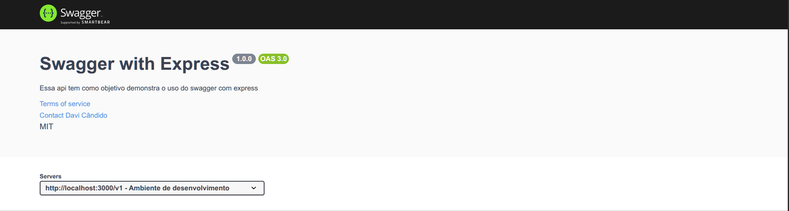
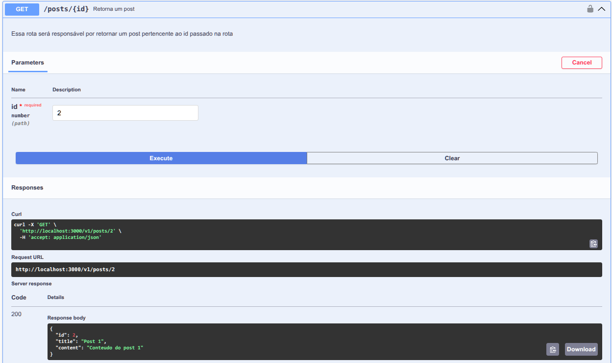
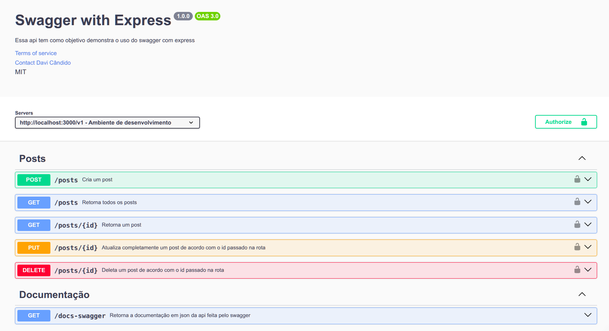

# Fazendo documentações de apis Express com Swagger UI e swagger-jsdoc

🧱 1. Instale as bibliotecas

Baixe a biblioteca Swagger UI Express e swagger-jsdoc:

```
npm install swagger-ui-express

npm install swagger-jsdoc
```


### 📦 2. Importe e configure o Swagger UI no `server.js`

```js
const express = require("express");
const app = express();

const swaggerUi = require("swagger-ui-express"); //commonjs
const swaggerJSDoc = require("swagger-jsdoc"); 
// ou
//import swaggerUi from "swagger-ui-express"; //ES6
// import swaggerJSDoc from "swagger-jsdoc"; //ES6
```

```js
const option = {
  definition: {
    openapi: "3.0.0",
    info: {
      title: "Swagger with Express",
      description:
        "Essa api tem como objetivo demonstra o uso do swagger com express",
      version: "1.0.0",
      license: {
        name: "MIT",
      },
      termsOfService: "http://localhost:3000/terms/",
      contact: {
        name: "Usuário dono",
        email: "usuarioDono@gmail.com",
      },
    },
    servers: [
      {
        url: "http://localhost:3000/v1",
        description: "Ambiente de desenvolvimento",
      },
      {
        url: "https://www.crudJourney.com/v2",
        description: "Ambiente de produção",
      },
    ],
  },
  apis: [path.join(__dirname, "./routes/*.js")],
};
```

Adicione o middleware do swagger:

```js
const specs = swaggerJSDoc(option);

app.use("/api-docs", swaggerUi.serve, swaggerUi.setup(specs));
```

Visite [_http://localhost:3000/api-docs/_](http://localhost:3000/api-docs](http://localhost:3000/api-docs)) e vera algo proximo a isso:


Vera algo proximo a isso:

<p align="center">
    
</p>

### 🐾 7. O que queremos? - Swagger-Petstore 


Swagger também possui uma documentação de teste em: [https://petstore.swagger.io/](https://petstore.swagger.io/) — é assim que queremos que nossa documentação final fique:

<p align="center">
    
</p>

Você também pode acessar o JSON usado por essa documentação em: [https://petstore.swagger.io/v2/swagger.json](https://petstore.swagger.io/v2/swagger.json)


### 📌 7. Mapeando rotas da API

#### Rota GET `/posts`

Agora iremos fazer um mapeamento de todas as rotas presente ou que futuramente estarão presentes em nossa api, vamos iniciar mapeando a nossa primeira rota de get:

```js
/**
 * @openapi
 * /posts:
 *   get:
 *     summary: Retorna todos os posts
 *     description: Essa rota será responsável por retornar todos os posts
 *     tags: [Posts]
 *     security:
 *       - bearerAuth: []
 *     responses:
 *       200:
 *         description: Retorna todos os posts
 *       404:
 *         description: Nenhum post foi encontrado
 */
router.get("/", crudController.index);
```

Podemos também colocar um conteudo de exemplo que será retornado ao obtermos o status de resposta 200:


```js
/**
 * @openapi
 * /posts:
 *   get:
 *     summary: Retorna todos os posts
 *     description: Essa rota será responsável por retornar todos os posts
 *     tags: [Posts]
 *     security:
 *       - bearerAuth: []
 *     responses:
 *       200:
 *         description: Retorna todos os posts
 *         content:
 *           application/json:
 *             schema:
 *               type: array
 *               example:
 *                 - id: 1
 *                   title: Post 1
 *                   content: Conteudo do post 1
 *                 - id: 2
 *                   title: Post 2
 *                   content: Conteudo do post 2
 *                 - id: 3
 *                   title: Post 3
 *                   content: Conteudo do post 3
 *       404:
 *         description: Nenhum post foi encontrado
 *         content:
 *           application/json:
 *             schema:
 *               type: object
 *               example:
 *                 message: Nenhum post foi encontrado
 */
router.get("/", crudController.index);
```

#### Rota POST `/posts` com `requestBody`


Para o método post teremos um tratamento um pouco diferente, teremos uma propriedade chamada _requestBody_ que será responsável por dizer o tipo de dado requerido, que no nosso caso é o application/json, que por sua vez conterá o schema, ou seja o esquema referente ao formato como esses dados devem ser enviados, com seus atributos e tipos, veja que o esquema e feito através de um componente que é referenciado através do _$ref_, o esquema em sí foi definido em "componentes" no inicio do arquivo de rota:

```js
   /**
 * @openapi
 * components:
 *   schemas:
 *     Post:
 *       type: object
 *       required:
 *         - title
 *         - content
 *       properties:
 *         id:
 *           type: number
 *         title:
 *           type: string
 *         content:
 *           type: string
 */
```

```js
/**
 * @openapi
 * /posts:
 *   post:
 *     summary: Cria um post
 *     description: Essa rota cria um post
 *     tags: [Posts]
 *     security:
 *       - bearerAuth: []
 *     requestBody:
 *       required: true
 *       content:
 *         application/json:
 *           schema:
 *             $ref: '#/components/schemas/Post'
 *           examples:
 *             post:
 *               value:
 *                 title: Post 1
 *                 content: Conteudo do post 1
 *     responses:
 *       201:
 *         description: Post criado com sucesso
 *         content:
 *           application/json:
 *             schema:
 *               type: object
 *               example:
 *                 message: Post created successfully
 *                 post:
 *                   id: 1
 *                   title: Post 1
 *                   content: Conteudo do post 1
 *       400:
 *         description: Dados incorretos ou incompletos
 *         content:
 *           application/json:
 *             schema:
 *               type: object
 *               example:
 *                 message: Title and content are required
 */
router.post("/", crudController.save);
```

### 🔐 8. Autenticação com JWT

Extra: Caso a api use autentificações de segurança como JWT, também se é preciso informar em nossa documentação, para isso criamos um campo de securitySchemes no mesmo nível do post em componentes

```js
/**
 * @openapi
 * components:
 *   schemas:
 *     Post:
 *       [...] --> Conteúdo referente ao post (Repare que o securitySchemes esta no mesmo nível do schemas de Post)
 *     securitySchemes:
 *       bearerAuth:
 *         type: http
 *         scheme: bearer
 *         bearerFormat: JWT
 */
```


Entenda melhor a estrutura do schemas de autentificação:

| Campo                   | Significado                                                                                                   |
| ----------------------- | ------------------------------------------------------------------------------------------------------------- |
| `"type": "http"`        | Diz que o tipo de segurança é baseado em HTTP.                                                                |
| `"scheme": "bearer"`    | Indica que a autenticação é via o esquema **Bearer Token**. Ex: `Authorization: Bearer <token>`               |
| `"bearerFormat": "JWT"` | Apenas uma **dica para ferramentas** como Swagger UI saberem que o token é um JWT. Não afeta a lógica da API. |


Agora nas rotas protegidas adicione uma tag de security, no mesmo nivel do summary, description e tags, dessa forma:

```js
/**
 * @openapi
 * /posts:
 *   get:
 *     summary: Retorna todos os posts
 *     description: Essa rota será responsável por retornar todos os posts
 *     tags: [Posts]
 *     security:
 *       - bearerAuth: []
 *     responses:
 *      [...]
 */
router.get("/", crudController.index);
```

Acesse novamente nossa documentação em http://localhost:3000/api-docs/ e veja que temos agora um cadeado no canto direito de nossa rota get, informando que esta rota é um rota autenticada:

<p align="center">
    
</p>


### 🔍 9. Parâmetros em rotas

#### GET `/posts/{id}`


Para rotas que exigem a passagem de parâmetros (params ou query) criamos uma rota no mesmo nível da anterior rota defina como _/posts_, no entanto agorá definimos em parameters o tipo de parâmetro exigido, informando o nome do parâmetro, se sera através de query, ou params (path), se seu envio é obrigatório (required) e seu esquema de tipo, veja o exemplo:

```js
/**
 * @openapi
 * /posts/{id}:
 *   get:
 *     summary: Retorna um post
 *     description: Essa rota será responsável por retornar um post pelo id
 *     tags: [Posts]
 *     parameters:
 *       - in: path
 *         name: id
 *         required: true
 *         schema:
 *           type: number
 *     security:
 *       - bearerAuth: []
 *     responses:
 *       200:
 *         description: Post encontrado
 *       404:
 *         description: Nenhum post foi encontrado
 */
router.get("/:id", crudController.show);
```

Veja que agora na rota apresentada em nossa documentação sera criado um campo de teste onde poderemos adicionar um id de busca, tornando a busca especifica pelo {id} passado: 


<p align="center">
    
</p>

### ✏️ 10. PUT `/posts/{id}` – Atualização completa

De forma semelhante agora podemos criar a documentação de nossas rotas de _PUT_ (atualização total) e _DELETE_, para a rota de _PUT_ segue o exemplo a baixo, veremos que nada mais do que se trata de uma adição de um _requestBody_ para informar os dados que serão enviados para atualização do post pertencente ao id informado em _parameters_, veja:


```js
/**
 * @openapi
 * /posts/{id}:
 *   put:
 *     summary: Atualiza um post
 *     description: Atualiza completamente um post pelo id
 *     tags: [Posts]
 *     parameters:
 *       - in: path
 *         name: id
 *         required: true
 *         schema:
 *           type: number
 *     security:
 *       - bearerAuth: []
 *     requestBody:
 *       required: true
 *       content:
 *         application/json:
 *           schema:
 *             $ref: '#/components/schemas/Post'
 *           examples:
 *             post:
 *               value:
 *                 title: Post Atualizado
 *                 content: Conteudo atualizado
 *     responses:
 *       200:
 *         description: Post atualizado com sucesso
 *       404:
 *         description: Post não encontrado
 */
router.put("/:id", crudController.update);
```

### 🗑️ 11. DELETE `/posts/{id}`

E para a rota de delete:

```js
/**
 * @openapi
 * /posts/{id}:
 *   delete:
 *     summary: Deleta um post
 *     description: Deleta um post pelo id
 *     tags: [Posts]
 *     parameters:
 *       - in: path
 *         name: id
 *         required: true
 *         schema:
 *           type: number
 *     security:
 *       - bearerAuth: []
 *     responses:
 *       200:
 *         description: Post deletado com sucesso
 *       404:
 *         description: Post não encontrado
 */
router.delete("/:id", crudController.destroy);
```
### 📁 12. Rota `/docs-swagger` para documentação JSON

E para finalizar podemos documentar uma rota que será responsável por fornecer nossa documentação em json. O fornecimento será feito através do envio do próprio specs anteriormente definido:

```js
  /**
 * @openapi
 * /docs-swagger:
 *   get:
 *     summary: Retorna a documentação em JSON da API
 *     description: Essa rota retorna a especificação Swagger gerada para a API
 *     tags: [Documentação]
 *     responses:
 *       200:
 *         description: Documentação da API
 *         content:
 *           application/json: {}
 *       404:
 *         description: Documentação não encontrada
 *         content:
 *           application/json:
 *             schema:
 *               type: object
 *               example:
 *                 message: Documentação não encontrada
 */
router.get("/docs-swagger", (req, res) => {
  res.json(specs);
});
```

### 🌐 13 Visualização final

Veja por fim como ficou nossa documentação de nossa api:

<p align="center">
    
</p>

Lembre-se que isso não é tudo. Muito mais pode ser explorado.

✅ Agora sua documentação Swagger está completa, com suporte para autenticação, rotas REST, schemas e testes interativos.

Use https://editor.swagger.io para validar seu swagger.json!

<br>
📘 Esse tutorial foi escrito por Davi Cândido – PUC Minas. Compartilhe com colegas desenvolvedores!
