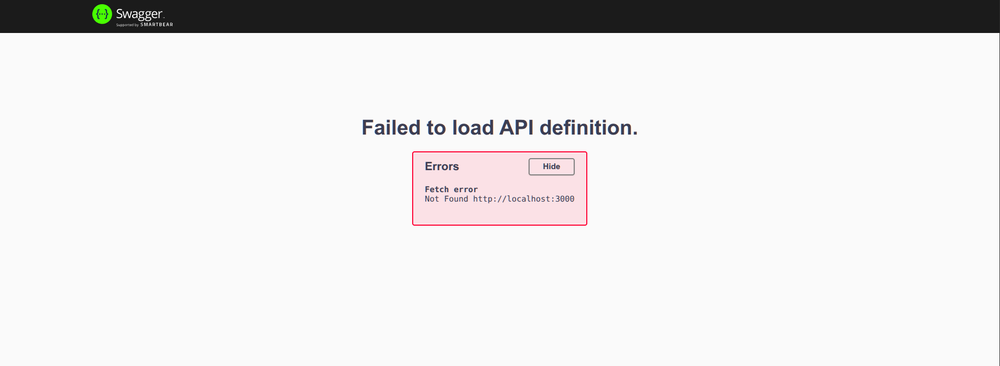
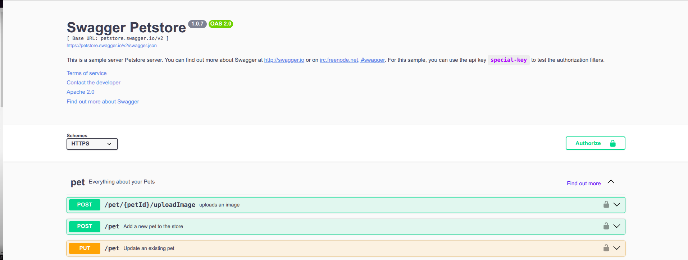
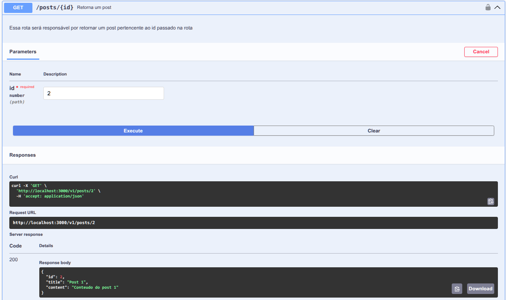
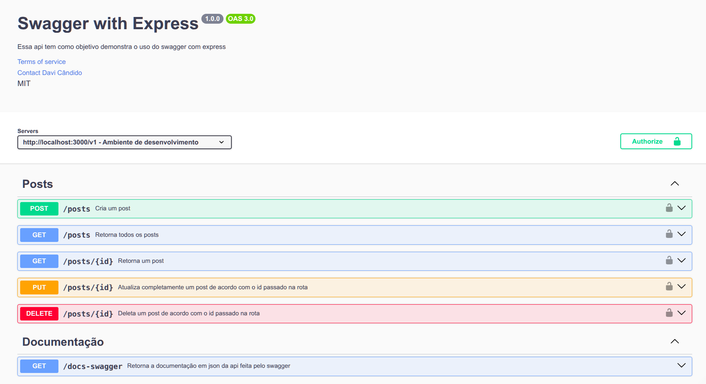

# Fazendo documentações de apis Express com Swagger UI

🧱 1. Instale a biblioteca

Baixe a biblioteca Swagger UI Express:

```
npm install swagger-ui-express
```

### 📄 2. Crie o arquivo `swagger.json` na raiz do projeto

Crie na raiz do projeto um arquivo chamado swwagger.json ou swagger.yaml e coloque uma chave vazia em seu conteúdo:

```json
swagger.json
{}
```

### 📦 3. Importe e configure o Swagger UI no `server.js`

```js
const express = require("express");
const app = express();

const swaggerUi = require("swagger-ui-express"); //commonjs
// ou
//import swaggerUi from "swagger-ui-express"; //ES6
```

Adicione o middleware do swagger:

```js
app.use("api-docs", swaggerUi.serve, swaggerUi.setup(require("./swagger")));

//Ou para melhor legibilidade:
// const swaggerDocs = require("./swagger.json");
// app.use("api-docs", swaggerUi.serve, swaggerUi.setup(swaggerDocs));
```

Visite [_http://localhost:3000/api-docs/_](http://localhost:3000/api-docs](http://localhost:3000/api-docs)) e vera algo proximo a isso:

<p align="center">
    
</p>

### 📚 4. Estrutura básica do Swagger

Como não temos nenhuma definição até o momento a documentação ainda não estará acessível, adicione agora o cabeçalho de nossa documentação e acesse novamente http://localhost:3000/api-docs/:

```json
{
  "openapi": "3.0.0",
  "info": {
    "title": "Swagger with Express",
    "description": "Essa api tem como objetivo demonstra o uso do swagger com express",
    "version": "1.0.0"
  }
}
```

Vera algo proximo a isso:

<p align="center">
    
</p>

Swagger também possui uma documentação de teste em: [https://petstore.swagger.io/](https://petstore.swagger.io/) — é assim que queremos que nossa documentação final fique:

<p align="center">
    
</p>

Você também pode acessar o JSON usado por essa documentação em: [https://petstore.swagger.io/v2/swagger.json](https://petstore.swagger.io/v2/swagger.json)


### 🧩 5. Melhorando o cabeçalho

Agora vamos deixar essa cabeçalho um pouco mais completo, iremos adicionar uma rota de acesso aos termos de uso de nossa api que poderá ser disponibilizada através de uma pagina estática fornecida pelo servido ou uma rota a parte, também colocaremos um contato de referencia

```json
    "openapi": "3.0.0",
    "info": {
        "title": "Swagger with Express",
        "description": "Essa api tem como objetivo demonstra o uso do swagger com express",
        "version": "1.0.0",
        "termsOfService": "http://localhost:3000/terms/",
        "contact": {
            "name": "Usuário dono",
            "email": "usuarioDono@gmail.com",
        }
    },
```

### 🌐 6. Definindo servidores

Em seguida vamos informar quais urls nossa Api será disponibilizada

```json
  "openapi": "3.0.0",
    "info": {
      ...
    },
    "servers": [{
        "url": "http://localhost:3000/v1",
        "description": "Ambiente de desenvolvimento"
     },
     {
        "url": "www.crudJourney.com/v2",
        "description": "Ambiente de produção"
     }
    ]
```

### 📌 7. Mapeando rotas da API

#### Rota GET `/posts`

Agora iremos fazer um mapeamento de todas as rotas presente ou que futuramente estarão presentes em nossa api, vamos iniciar mapeando a nossa primeira rota de get:

```json
  "openapi": "3.0.0",
    "info": {
      ...
    },
    "servers": ...,
    "paths": {
        "/posts":{
            "summary": "Retorna todos os posts",
            "description": "Essa rota será responsável por retorna todos os posts",
            "get": {
                "tags": ["Posts"],
                "responses": {
                    "200": {
                        "description": "Retorna todos os posts"
                    },
                    "404": {
                        "description": "Nenhum post foi encontrado"
                    }
                }
            }
        }
      }
```

Podemos também colocar um conteudo de exemplo que será retornado ao obtermos o status de resposta 200:


```json
"paths": {
  "/posts":{
      "summary": "Retorna todos os posts",
      "description": "Essa rota será responsável por retorna todos os posts",
      "get": {
          "tags": ["Posts"],
          "responses": {
              "200": {
                  "description": "Retorna todos os posts",
                  "content": {
                    "application/json": {
                      "schema": {
                        "type": "array",
                        "example": [
                          {
                            "id": 1,
                            "title": "Post 1",
                            "content": "Conteudo do post 1"
                          },
                          {
                            "id": 2,
                            "title": "Post 2",
                            "content": "Conteudo do post 2"
                          },
                          {
                            "id": 3,
                            "title": "Post 3",
                            "content": "Conteudo do post 3"
                          }
                        ]
                      }
                    }
                  }
                },
              "404": {
                  "description": "Nenhum post foi encontrado"
              }
          }
      }
  }
}
```

#### Rota POST `/posts` com `requestBody`


Para o método post teremos um tratamento um pouco diferente, teremos uma propriedade chamada _requestBody_ que será responsável por dizer o tipo de dado requerido, que no nosso caso é o application/json, que por sua vez conterá o schema, ou seja o esquema referente ao formato como esses dados devem ser enviados, com seus atributos e tipos, veja que o esquema e feito através de um componente que é referenciado através do _$ref_, o esquema em sí foi definido em "componentes":

```json
    "post": {
        "summary": "Cria um post",
        "description": "Essa rota cria um post",
        "tags": ["Posts"],
        "requestBody": {
          "content": {
            "application/json": {
              "schema": {
                "$ref": "#/components/schemas/Post"
              },
              "examples": {
                "post": {
                  "value": {
                    "title": "Post 1",
                    "content": "Conteudo do post 1"
                  }
                }
              }
            }
          }
        },
        "responses": {
          "201": {
            "description": "Post criado com sucesso"
          },
          "404": {
            "description": "Dados incorretos ou incompletos"
          }
        }
      }
    }
  },
  "components": {
    "schemas": {
      "Post": {
        "type": "object",
        "required": ["title", "content"],
        "properties": {
          "id": {
            "type": "number"
          },
          "title": {
            "type": "string"
          },
          "content": {
            "type": "string"
          }
        }
      }
    }
  }
```

### 🔐 8. Autenticação com JWT

Extra: Caso a api use autentificações de segurança como JWT, também se é preciso informar em nossa documentação, para isso criamos um campo de securitySchemes no mesmo nível do post em componentes

```json
"components": {
    "schemas": {
      ...
    },
    "securitySchemes": {
      "bearerAuth": {
        "type": "http",
        "scheme": "bearer",
        "bearerFormat": "JWT"
      }
    }
  }
```

Entenda melhor a estrutura do schemas de autentificação:

| Campo                   | Significado                                                                                                   |
| ----------------------- | ------------------------------------------------------------------------------------------------------------- |
| `"type": "http"`        | Diz que o tipo de segurança é baseado em HTTP.                                                                |
| `"scheme": "bearer"`    | Indica que a autenticação é via o esquema **Bearer Token**. Ex: `Authorization: Bearer <token>`               |
| `"bearerFormat": "JWT"` | Apenas uma **dica para ferramentas** como Swagger UI saberem que o token é um JWT. Não afeta a lógica da API. |


Agora nas rotas protegidas adicione uma tag de security, no mesmo nivel do summary, description e tags, dessa forma:

```json
"paths": {
    "/posts": {
      "get": {
        "summary": "Retorna todos os posts",
        "description": "Essa rota será responsável por retorna todos os posts",
        "tags": ["Posts"],
        "security": [{
          "bearerAuth": []
        }], 
        ...
```

Acesse novamente nossa documentação em http://localhost:3000/api-docs/ e veja que temos agora um cadeado no canto direito de nossa rota get, informando que esta rota é um rota autenticada:

<p align="center">
    
</p>


### 🔍 9. Parâmetros em rotas

#### GET `/posts/{id}`


Para rotas que exigem a passagem de parâmetros (params ou query) criamos uma rota no mesmo nível da anterior rota defina como _/posts_, no entanto agorá definimos em parameters o tipo de parâmetro exigido, informando o nome do parâmetro, se sera através de query, ou params (path), se seu envio é obrigatório (required) e seu esquema de tipo, veja o exemplo:

```json
"paths": {
    "/posts": {
      "get": {
        ...
      },
      "post": {
        ...
      }
    },
    "/posts/{id}": {
      "get": {
        "summary": "Retorna um post",
        "description": "Essa rota será responsável por retornar um post pertencente ao id passado na rota",
        "tags": ["Posts"],
        "parameters": [
          {
            "name": "id",
            "in": "path", //ou query
            "required": true,
            "schema": {
              "type": "number"
            }
          }
        ],
        "security": [{
            "bearerAuth": []
        }],
        "responses": {
          "200": {
            "description": "Retorna o post pertencente ao {id}",
            "content": {
              "application/json": {
                "schema": {
                  "type": "object",
                  "example": {
                      "id": 1,
                      "title": "Post 1",
                      "content": "Conteudo do post 1"
                  }
                }
              }
            }
          },
          "404": {
            "description": "Nenhum post foi encontrado"
          }
        }
      }
    }
```

Veja que agora na rota apresentada em nossa documentação sera criado um campo de teste onde poderemos adicionar um id de busca, tornando a busca especifica pelo {id} passado: 


<p align="center">
    
</p>

### ✏️ 10. PUT `/posts/{id}` – Atualização completa

De forma semelhante agora podemos criar a documentação de nossas rotas de _PUT_ (atualização total) e _DELETE_, para a rota de _PUT_ segue o exemplo a baixo, veremos que nada mais do que se trata de uma adição de um _requestBody_ para informar os dados que serão enviados para atualização do post pertencente ao id informado em _parameters_, veja:


```json
"/posts/{id}": {
      "get": {
        ...
      },
      "put": {
        "summary": "Atualiza completamente um post de acordo com o id passado na rota",
        "description": "Essa rota será responsável por atualizar completamente um post de acordo com o id passado na rota",
        "tags": ["Posts"],
        "parameters": [{
            "name": "id",
            "in": "path",
            "required": true,
            "schema": {
              "type": "number"
            }
        }],
        "security": [{
            "bearerAuth": []
        }],
        "requestBody": {
          "content": {
            "application/json": {
              "schema": {
                "$ref": "#/components/schemas/Post"
              },
              "examples": {
                "post": {
                  "value": {
                    "title": "Post 1 atualizado",
                    "content": "Conteudo do post 1 atualizado"
                  }
                }
              }
            }
          }
        },
        "responses": {
          "200": {
            "description": "Retorna o post atualizado pertencente ao {id}",
            "content": {
              "application/json": {
                "schema": {
                  "type": "object",
                  "example": {
                    "message": "Post atualizado com sucesso",
                    "post": {
                      "id": 1,
                      "title": "Post 1 atualizado",
                      "content": "Conteudo do post 1 atualizado"
                    }
                  }
                }
              }
            }
          },
          "404": {
            "description": "Nenhum post foi encontrado"
          }
        }
      }
    }
```

### 🗑️ 11. DELETE `/posts/{id}`

E para a rota de delete:

```json
    "/posts/{id}": {
      "get": {
        ...
      },
      "put": {
        ...
      },
      "delete": {
        "summary": "Deleta um post de acordo com o id passado na rota",
        "description": "Essa rota será responsável por deletar um post de acordo com o id passado na rota",
        "tags": ["Posts"],
        "parameters": [{
            "name": "id",
            "in": "path",
            "required": true,
            "schema": {
              "type": "number"
            }
        }],
        "security": [{
            "bearerAuth": []
        }],
        "responses": {
          "200": {
            "description": "Retorna se o post pertencente ao {id} foi deletado",
            "content": {
              "application/json": {
                "schema": {
                  "type": "object",
                  "example": {
                    "message": "Post deletado com sucesso"
                  }
                }
              }
            }
          },
          "404": {
            "description": "Nenhum post foi encontrado"
          }
        }
      }
    },
```
### 📁 12. Rota `/docs-swagger` para documentação JSON

E para finalizar podemos documentar uma rota que será responsável por fornecer nossa documentação em json, fornecimento feito através do envio de um arquivo estático, neste caso nosso swagger.json:

```json
  "paths": {
    "/posts": {
       ...
    },
    "/posts/{id}": {
      ...
    },
    "/docs-swagger": {
      "get": {
        "summary": "Retorna a documentação em json da api feita pelo swagger",
        "description": "Essa rota retorna a documentação em json da api feita pelo swagger",
        "tags": ["Documentação"],
        "responses": {
          "200": {
            "description": "Retorna a documentação",
            "content": {
              "text/json": {}
            }
          }
        }
      }
    }
  },
```

### 🌐 13 Visualização final

Veja por fim como ficou nossa documentação de nossa api:

<p align="center">
    
</p>

Lembre-se que isso não é tudo. Muito mais pode ser explorado.

✅ Agora sua documentação Swagger está completa, com suporte para autenticação, rotas REST, schemas e testes interativos.

Use https://editor.swagger.io para validar seu swagger.json!

📘 Esse tutorial foi escrito por Davi Cândido – PUC Minas. Compartilhe com colegas desenvolvedores!
